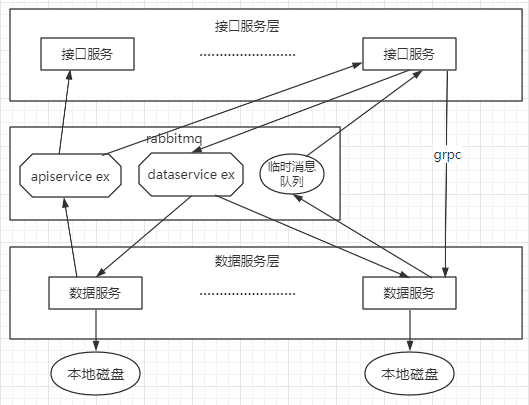
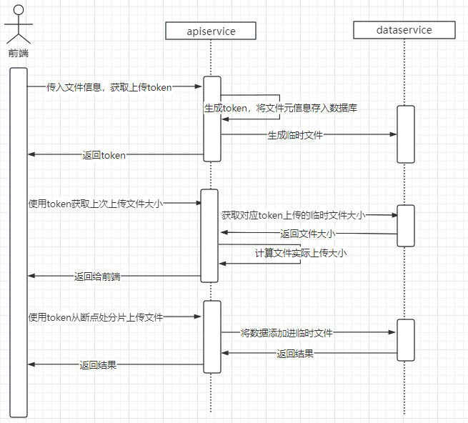
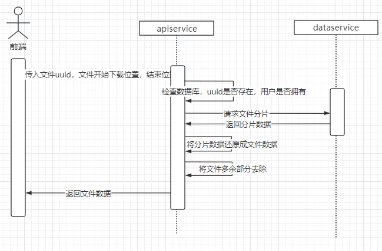

<h1 align="center">nagato🍀</h1>
<h4 align="center">Data Integration Thought Entity</h4>

## 简易的网盘和资源管理系统 💯
### 项目结构
- apiservice: 数据库和api服务
- dataservice: 数据服务
- ~~searchservice: 搜索服务(已废弃，移动到apiservice)~~

apiservice 使用 `grpc` 调用 dataservice 的 api，采用了消息队列(rabbitmq)来注册服务

架构图:

`apiservice ex` 用于监听数据服务的心跳，`dataservice ex` 用于获取文件分片所在数据服务的地址和id

### 搜索模块
添加 blank 结构体，可以对多个文件添加描述和tag等的额外元信息，便于分类和检索。
创建和检索的elasticsearch语句见 [index.md](./searchservice/INDEX.md)。
resource是当个文件元信息，blank是额外的元信息

### 上传模块

#### 数据校验
考虑到数据传输过程中可能发生错误导致文件损坏，为防止将损害的文件保存，需要对文件进行数据校验。在数据和接口服务都会进行对文件的散列值计算，保证文件的正确性

#### 数据去重
当上传多个相同的文件时，数据服务实际上只保存了一个文件。去重基于对象的全局唯一标识符，也就是通过对该对象的散列值进行单例检查（Single Instance Storage，SIS）来实现。

#### 数据冗余
需要数据冗余的情况大致有两种

- 由于是分布式系统，所以需要保证在某些服务宕机的情况下整个服务仍然能够正常使用。但是在数据服务宕机的情况下服务器上的文件数据就离线了
- 在服务器上的文件数据丢失或者损坏了，包括但不限于硬盘损毁，数据降解等

本项目实现冗余的方式是通过 rs 纠删码将文件分片，存到不同的数据服务上。
RS纠删码允许我们选择数据片和校验片的数量，比如选择了4个数据片加两个校验片，也就是说会把一个完整的对象平均分成6个分片对象，其中包括4个数据片对象，每个对象的大小是原始对象大小的25%，另外还有两个校验片，其大小和数据片一样。这6个分片对象被接口服务存储在6个不同的数据服务节点上，只需要其中任意4个就可以恢复出完整的对象。

rs 纠删码比起直接做副本镜像更加节省空间，但是需要计算出分片耗时长

#### 分片上传/断点续传

### 下载模块

#### 分片下载/断点下载

#### 即时修复

下载文件时，需求请求 rs 数据片+校验片数量的数据服务，如果数量不足但是大于等于数据片的数量，虽然可以正常返回文件数据，但是有数据丢失的风险。那么需要在其他服务器上新上传该文件的 rs 分片

